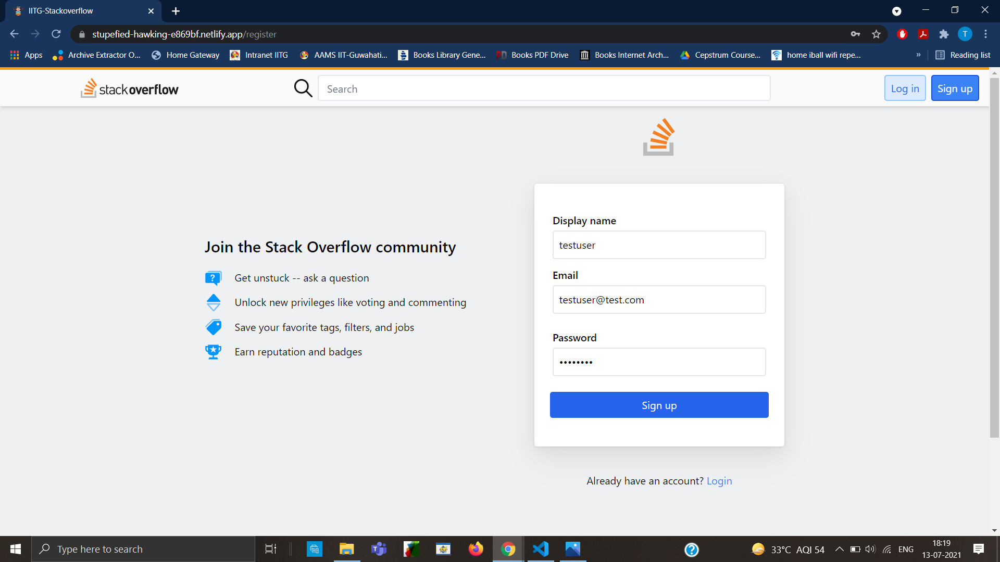
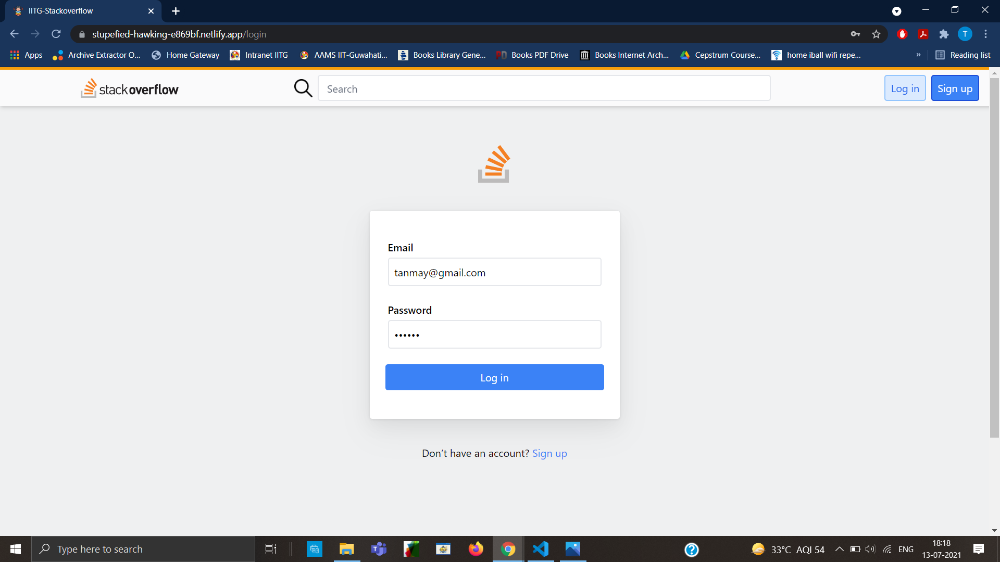
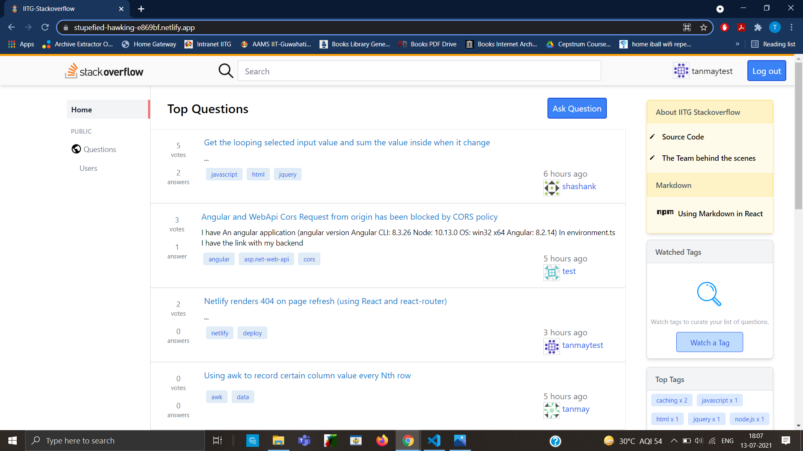
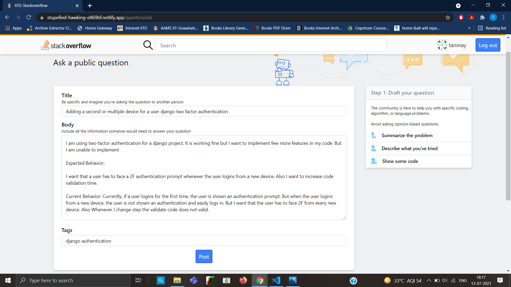
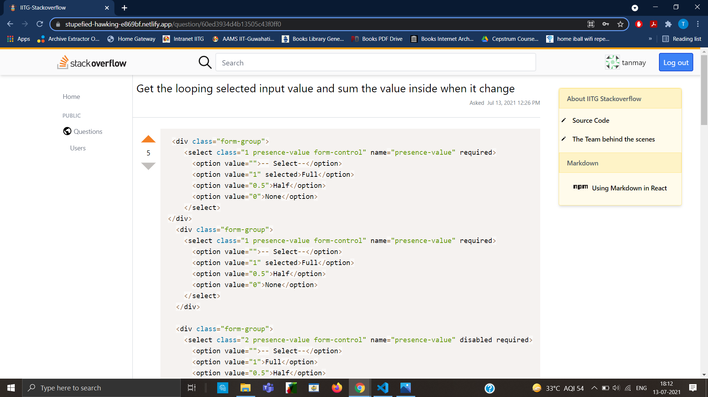
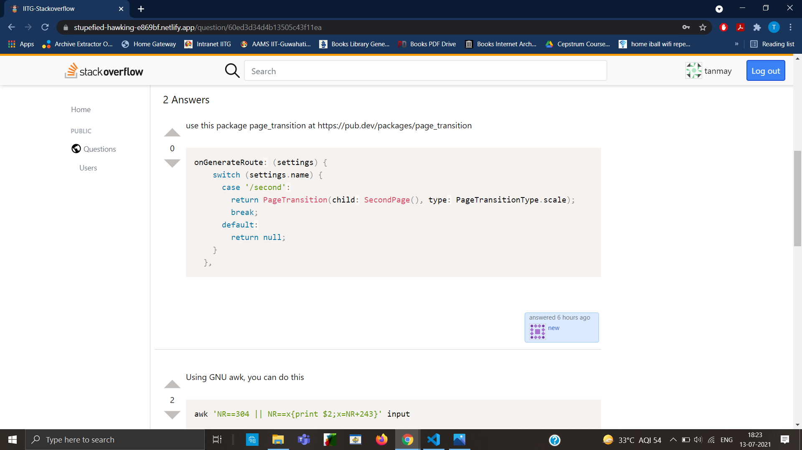
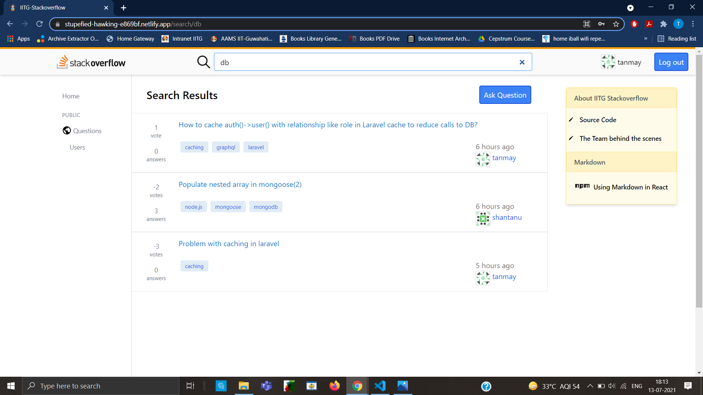
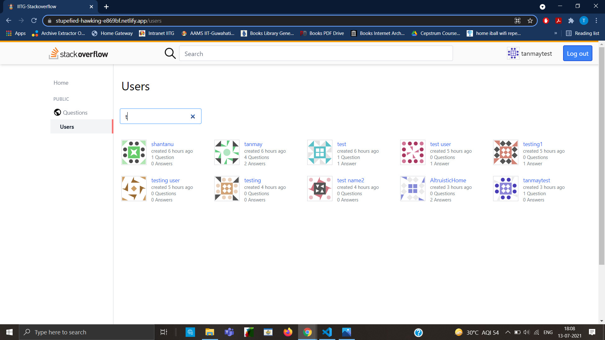
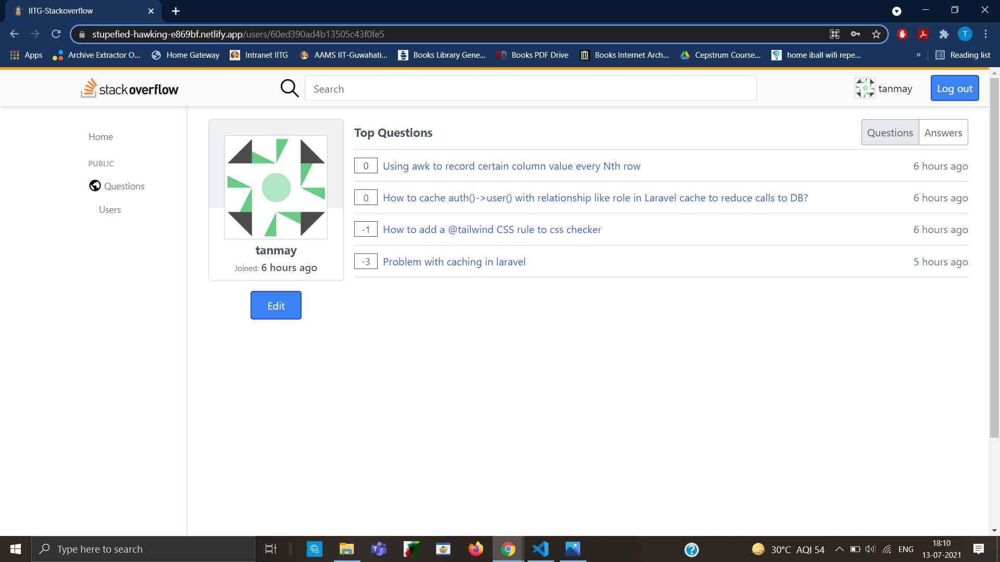
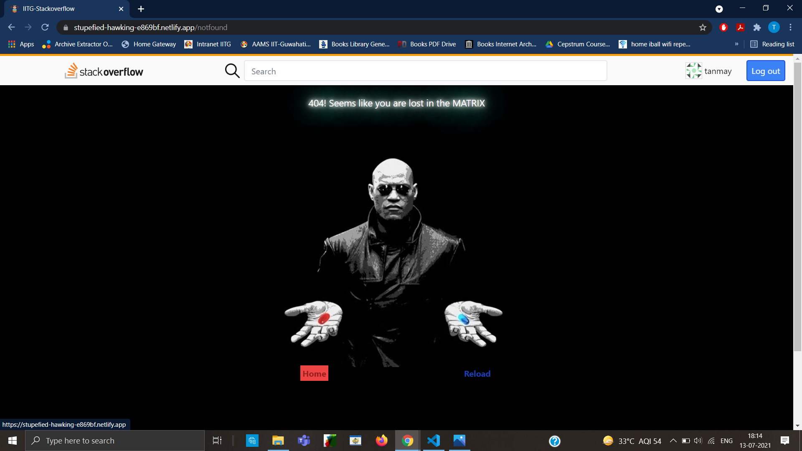

## Tech Stack [MERN]
#### Front-end
* Front-end Framework: `React.js (with Redux)`
* Styling: `Tailwind CSS`

#### Back-end
* For handling server requests: `Node.js with Express.js Framework`
* As Database: `MongoDB`
* API tested using: `POSTMAN`
* Authentication: `JWT`

## Screenshots

#### Register

#### Login

#### Home

#### Ask

#### Question

#### Answer

#### Search

#### Users

#### Profile

#### NotFound

